# PSOC&trade; 4 training manual: CAPSENSE&trade; built-in self-test (BIST)

## About this document

### Scope and purpose
This document is a training manual for the hands-on exercise of CAPSENSE&trade; middleware built-in self-test (BIST) on PSOC&trade; 4.

### Intended audience
This manual is intended for design engineers, technicians, and developers of electronic systems.

---

## Introduction

This manual provides specific instructions to create, configure, build, and run the code examples on the PSOC&trade; 4100T Plus. In this lab session, you will learn how to use the CAPSENSE&trade; middleware built-in self-test (BIST) to validate the operation of a capacitive sensing system.

---

## Required development tools and prerequisites

### Tools
* **ModusToolbox&trade; software** v3.8 or later (Recommended installation via [ModusToolbox&trade; Setup tool](https://softwaretools.infineon.com/tools/com.ifx.tb.tool.modustoolboxsetup))
* [**Microsoft Visual Studio Code**](https://code.visualstudio.com/) with the [**ModusToolbox&trade; for VS Code**](https://marketplace.visualstudio.com/items?itemName=InfineonAG.modustoolbox-for-vscode) extension installed
* **ModusToolbox&trade; programming tools** v1.9.0 or later (Installed by [ModusToolbox&trade; Setup tool](https://softwaretools.infineon.com/tools/com.ifx.tb.tool.modustoolboxsetup) as a dependency to ModusToolbox&trade; v3.8)
* **ModusToolbox&trade; CAPSENSE&trade; and Multi-Sense Pack** v1.5.0 or later (Recommended installation via [ModusToolbox&trade; Setup tool](https://softwaretools.infineon.com/tools/com.ifx.tb.tool.modustoolboxsetup))
* **Terminal emulator** (Instructions in this document use Tera Term)
* **PSOC&trade; 4100T Plus Prototyping Kit** ([CY8CPROTO-041TP](https://www.infineon.com/evaluation-board/CY8CPROTO-041TP))
* **Male-to-male jumper wires**

### Prerequisites
Install the software and obtain the hardware listed in the [Required development tools and prerequisites](#required-development-tools-and-prerequisites) section.

This manual does not cover the basic concepts of ModusToolbox&trade; and PSOC&trade; 4100T Plus.

* For an introduction to PSOC&trade;, including a getting started guide to ModusToolbox&trade;, go to: [PSOC&trade; Developer](https://www.infineon.com/product-information/psocdeveloper)
* For the PSOC&trade; 4 CAPSENSE&trade; using PSOC&trade; 4000T and PSOC&trade; 4100T Plus training, go to: [PSOC&trade; 4 CAPSENSE&trade; training manual](https://github.com/Infineon/mtb-training-psoc-4-msclp-capsense)

---

## Executing the built-in self-tests

### Objective
In this lab, you will use the MSCLP low-power CSD button example to enable and run the built-in self-tests for the CAPSENSE&trade; middleware.

### Project creation

1. <span id="step1-workspace-creation"></span>Open **ModusToolbox&trade;** from the **Windows Start** menu

> **Note:** If you have not installed ModusToolbox&trade;, see the [Required development tools](#required-development-tools-and-prerequisites) section.


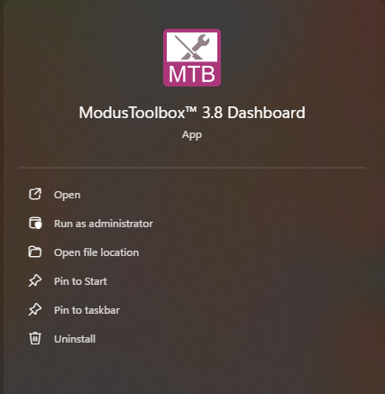

2. <span id="step2-directory-selection"></span> Select your **Target IDE** (you will use **Microsoft Visual Studio Code**), and then click **Launch Project Creator**


3. **Project Creator** tool prompts you to choose a **BSP** (board support package)

> **Note:** BSPs are aligned with our development/evaluation kits; they provide files for basic device functionality. A BSP typically has a `design.modus` file that configures clocks and other board-specific capabilities. That file is used by the ModusToolbox&trade; configurators. A BSP also includes the required device support code for the device on the board. You can modify the configuration to suit your application.

4. Once the **Project Creator** launches, select the **CY8CPROTO-041TP** BSP under the PSOC 4 BSPs, and then click **Next**

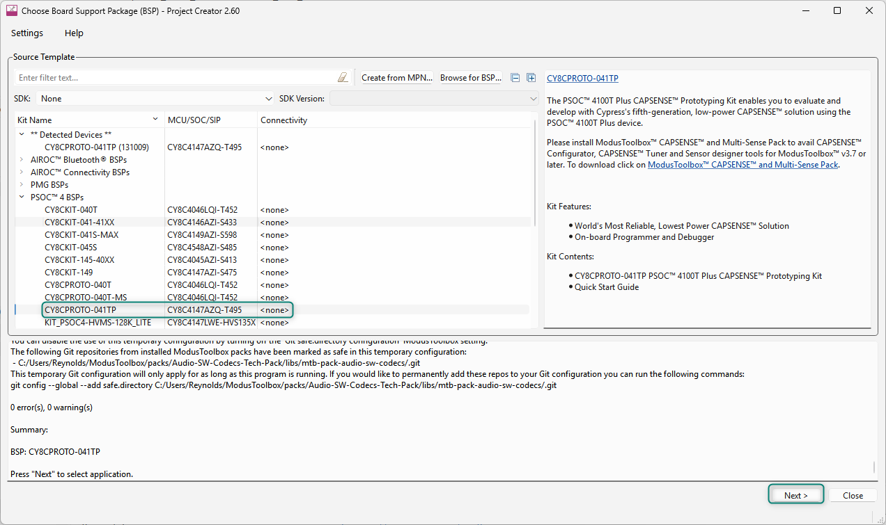

5. Click **Next** to proceed to the application selection menu. Select the **MSCLP Low Power CSD Button** under the Sensing section by clicking the **checkbox** near the application, and then click **Create**

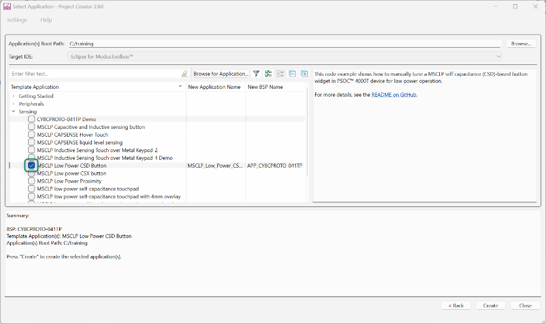

6. When you click **Create**, a new project is created. The project location is under the **Application root path**, in a folder with the given project name. Navigate to the project directory, and find the **.code-workspace** file and open it with Microsoft Visual Studio Code


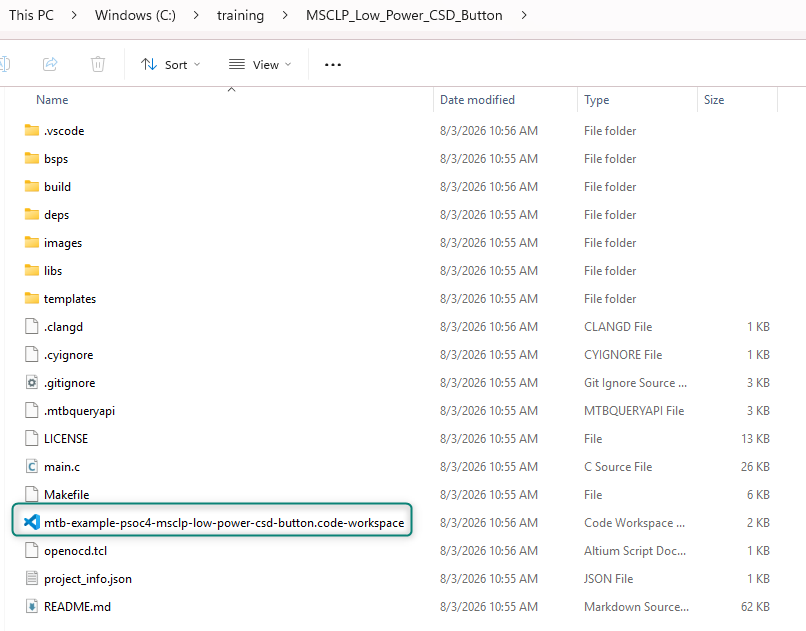

7. Once opened in Visual Studio Code, ensure that the ModusToolbox&trade; for VS Code extension is installed. When the extension is running, you will see it in the main panel

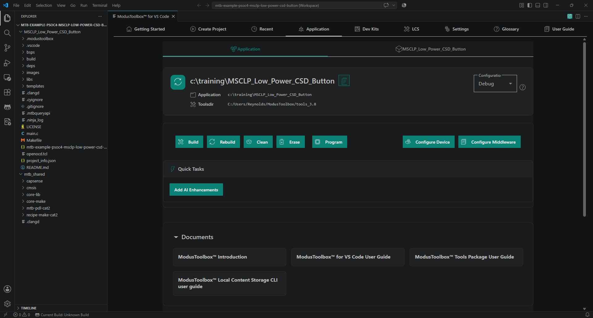

<br>

> **Note:** The ModusToolbox&trade; for VS Code extension may display buttons indicating that the VS Code tasks and settings need to be updated. Simply click the buttons to correct the issues. This is a minor version mismatch between the ModusToolbox&trade; tools and the VS Code extension and does not affect functionality.

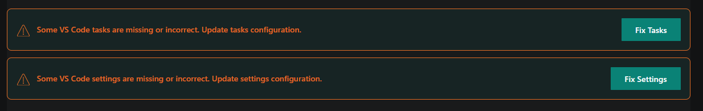


---

### Enabling the BIST libraries for CAPSENSE&trade;

1. In the ModusToolbox&trade; for VS Code extension, scroll down to **Tools**, and then open **CAPSENSE&trade; Configurator**

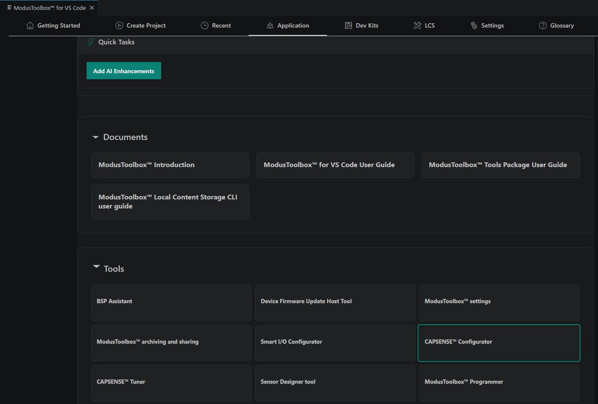

2. Navigate to the **Advanced** tab, and then click the **Enable self-test library** check box

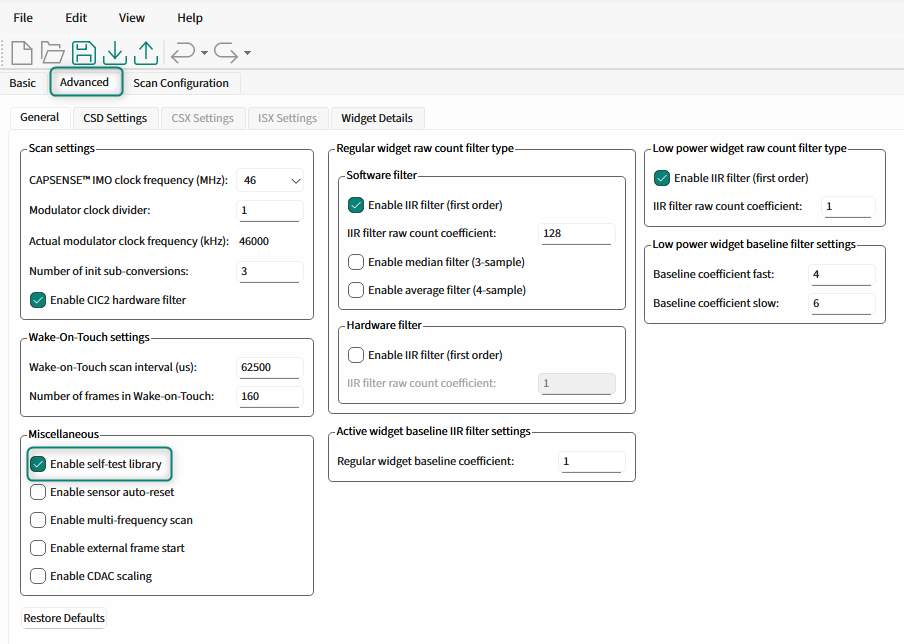

3. Save and close the **CAPSENSE&trade; Configurator**

4. Add the `Cy_CapSense_RunSelfTest` API to the main function in main.c using the `CY_CAPSENSE_BIST_RUN_AVAILABLE_SELF_TEST_MASK` input so that all available tests run:

```c
/* Initialize MSC CAPSENSE */
initialize_capsense();

/* Measures the actual ILO frequency and compensate MSCLP wake up timers */
Cy_CapSense_IloCompensate(&cy_capsense_context);

Cy_CapSense_RunSelfTest(CY_CAPSENSE_BIST_RUN_AVAILABLE_SELF_TEST_MASK, &cy_capsense_context);
```

5. Program the device from the ModusToolbox&trade; for VS Code extension


6. Open the **CAPSENSE&trade; Tuner** from the ModusToolbox&trade; for VS Code extension

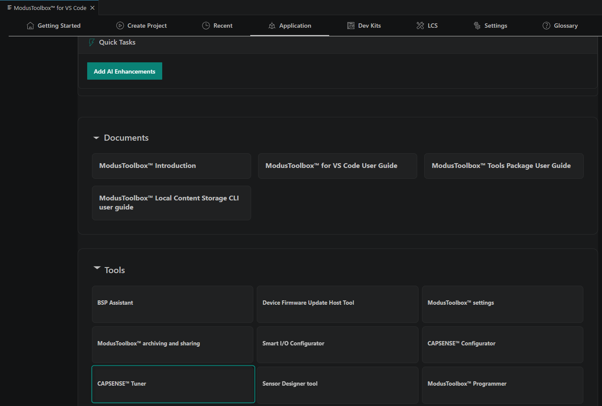

7. Connect to the device and enable the low-power sensor and button sensor widgets in the tuner

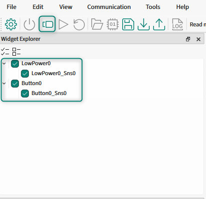

8. Click the button sensor widget and observe the measured capacitance

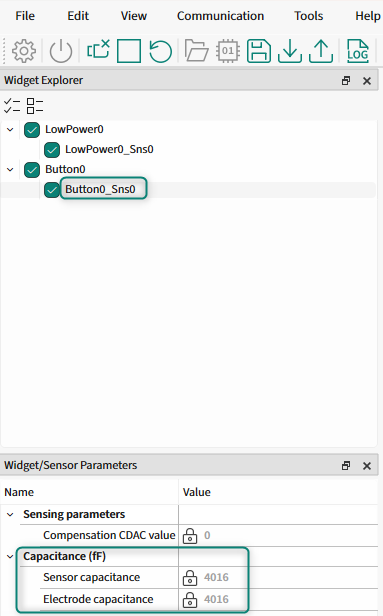

---

### Printing the BIST results to the UART terminal

1. Open the **Device Configurator** from the ModusToolbox&trade; for VS Code extension
2. Open the **Peripherals** tab, and then enable Serial Communication Block (SCB) 0 in UART mode
3. Select the clock, RX, and TX connections
4. Change the SCB0 alias name to `DEBUG_UART`

> **Note:** For more information on configuring and using the SCB, click on the **Configuration Help** documentation link.

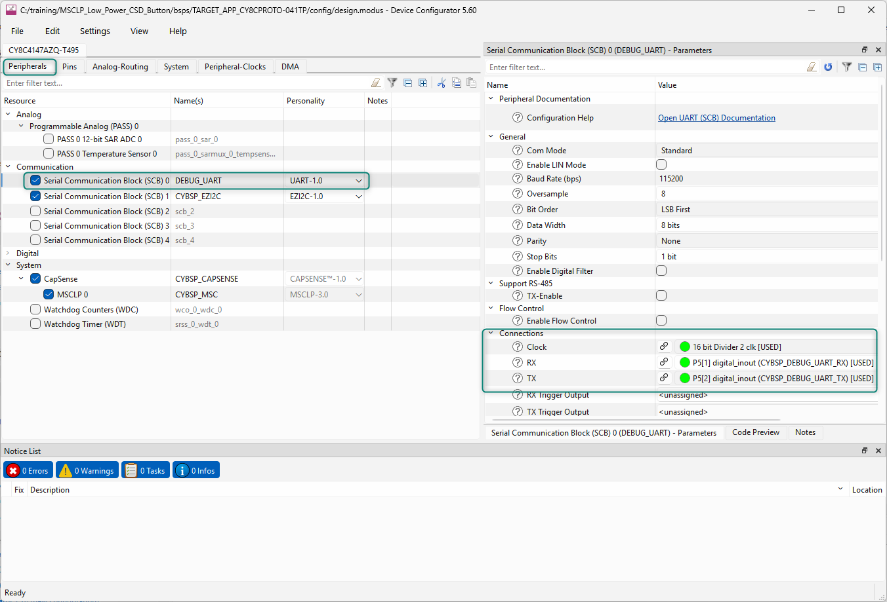

5. Save and close the **Device Configurator**
6. Include the standard IO library in the main.c file to use `sprintf`

```c
#include <stdio.h>
```

7. Enable the SCB in the main.c file so that the test results can be printed out. Add the following lines to configure and enable the UART:

```c
/* Configure UART to operate */
(void) Cy_SCB_UART_Init(DEBUG_UART_HW, &DEBUG_UART_config, NULL);

/* Enable UART to operate */
Cy_SCB_UART_Enable(DEBUG_UART_HW);

/* Enable global interrupts */
__enable_irq();

Cy_SCB_UART_PutString(DEBUG_UART_HW, "\x1b[2J\x1b[;H");
Cy_SCB_UART_PutString(DEBUG_UART_HW,
    "****************** \r\n"
    "PSOC 4100T Plus MCU: CAPSENSE BIST \r\n"
    "****************** \r\n\n");
```

8. Update the BIST execution so that the overall result is printed, as follows:

```c
/* Initialize MSC CAPSENSE */
initialize_capsense();

/* Measures the actual ILO frequency and compensate MSCLP wake up timers */
Cy_CapSense_IloCompensate(&cy_capsense_context);

if (CY_CAPSENSE_BIST_SUCCESS_E == Cy_CapSense_RunSelfTest(CY_CAPSENSE_BIST_RUN_AVAILABLE_SELF_TEST_MASK, &cy_capsense_context))
{
    Cy_SCB_UART_PutString(DEBUG_UART_HW, "Tests passed\r\n\n");
}
```

9. Add the following code block to display the results of all executed self-tests

```c
char print_string[120];
uint32_t shield_cap_measurement = *cy_capsense_context.ptrBistContext->ptrChShieldCap;
uint32_t cmod_1_cap_measurement = cy_capsense_context.ptrBistContext->cMod01Cap;
uint32_t cmod_2_cap_measurement = cy_capsense_context.ptrBistContext->cMod02Cap;
uint32_t lp_sensor_cap_measurement = cy_capsense_context.ptrWdConfig[CY_CAPSENSE_LOWPOWER0_WDGT_ID].ptrSnsCapacitance[CY_CAPSENSE_LOWPOWER0_SNS0_ID];
uint32_t button_sensor_cap_measurement = cy_capsense_context.ptrWdConfig[CY_CAPSENSE_BUTTON0_WDGT_ID].ptrSnsCapacitance[CY_CAPSENSE_BUTTON0_SNS0_ID];
uint32_t lp_electrode_cap_measurement = cy_capsense_context.ptrWdConfig[CY_CAPSENSE_LOWPOWER0_WDGT_ID].ptrEltdCapacitance[CY_CAPSENSE_LOWPOWER0_SNS0_ID];
uint32_t button_electrode_cap_measurement = cy_capsense_context.ptrWdConfig[CY_CAPSENSE_BUTTON0_WDGT_ID].ptrEltdCapacitance[CY_CAPSENSE_BUTTON0_SNS0_ID];
uint16_t vdda = cy_capsense_context.ptrBistContext->vddaVoltage;
uint32_t lp_sensor_crc = cy_capsense_context.ptrBistContext->ptrWdgtCrc[CY_CAPSENSE_LOWPOWER0_WDGT_ID];
uint32_t button_crc = cy_capsense_context.ptrBistContext->ptrWdgtCrc[CY_CAPSENSE_BUTTON0_WDGT_ID];

sprintf(print_string, "Shield Capacitance: %lu fF\r\n", shield_cap_measurement);
Cy_SCB_UART_PutString(DEBUG_UART_HW, print_string);
sprintf(print_string, "CMOD 1 Capacitance: %lu pF\r\n", cmod_1_cap_measurement);
Cy_SCB_UART_PutString(DEBUG_UART_HW, print_string);
sprintf(print_string, "CMOD 2 Capacitance: %lu pF\r\n", cmod_2_cap_measurement);
Cy_SCB_UART_PutString(DEBUG_UART_HW, print_string);
sprintf(print_string, "Low Power Sensor Capacitance: %lu fF\r\n", lp_sensor_cap_measurement);
Cy_SCB_UART_PutString(DEBUG_UART_HW, print_string);
sprintf(print_string, "Button Sensor Capacitance: %lu fF\r\n", button_sensor_cap_measurement);
Cy_SCB_UART_PutString(DEBUG_UART_HW, print_string);
sprintf(print_string, "Low Power Electrode Capacitance: %lu fF\r\n", lp_electrode_cap_measurement);
Cy_SCB_UART_PutString(DEBUG_UART_HW, print_string);
sprintf(print_string, "Button Electrode Capacitance: %lu fF\r\n", button_electrode_cap_measurement);
Cy_SCB_UART_PutString(DEBUG_UART_HW, print_string);
sprintf(print_string, "VDDA Voltage: %u mV\r\n", vdda);
Cy_SCB_UART_PutString(DEBUG_UART_HW, print_string);
sprintf(print_string, "Low Power Sensor CRC: 0x%lx\r\n", lp_sensor_crc);
Cy_SCB_UART_PutString(DEBUG_UART_HW, print_string);
sprintf(print_string, "Button Sensor CRC: 0x%lx\r\n", button_crc);
Cy_SCB_UART_PutString(DEBUG_UART_HW, print_string);
```

10. Program the device from the ModusToolbox&trade; for VS Code extension


11. Observe the terminal output

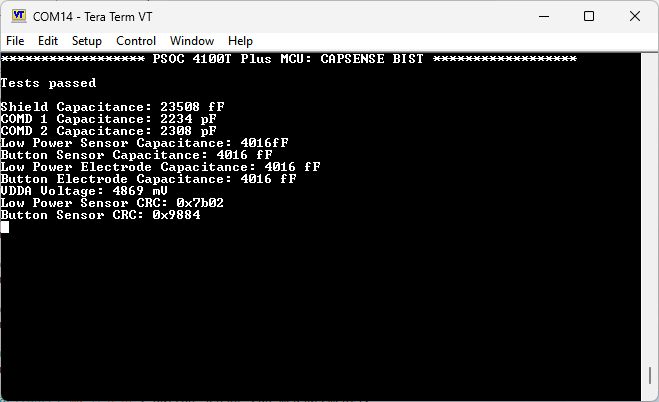

---

### Running the sensor integrity tests

The tests executed by the `Cy_CapSense_RunSelfTest` high-level CAPSENSE&trade; BIST API check the following items:

* Widget RAM integrity
* Sensor GPIO short to GND/VDD or to another sensor GPIO
* Sensor capacitance is within the MSCLP block's capabilities (1 pF to 200 pF)
* Electrode capacitance is within the MSCLP block's capabilities (1 pF to 200 pF)
* External capacitor ($C_{MOD}$) capacitance is within the acceptable range (2.2 nF &plusmn; 10%)
* $V_{DDA}$ voltage is within the acceptable range
* Shield electrode capacitance is within the MSCLP block's capabilities (1 pF to 200 pF)

The sensor raw counts integrity tests can be executed with more specific upper and lower limits. This integrity test verifies that the hardware and software configuration of a given sensor is functioning as expected.

1. Add a function to print the BIST test results

```c
void print_bist_test_result(char * test_name, cy_en_capsense_bist_status_t result)
{
    char test_result_string[50];
    char test_name_string[50];
    switch(result)
    {
        case CY_CAPSENSE_BIST_SUCCESS_E:
            sprintf(test_result_string, "Successful \r\n");
            break;
        case CY_CAPSENSE_BIST_BAD_PARAM_E:
            sprintf(test_result_string, "Bad Parameter \r\n");
            break;
        case CY_CAPSENSE_BIST_HW_BUSY_E:
            sprintf(test_result_string, "CAPSENSE HW Busy \r\n");
            break;
        case CY_CAPSENSE_BIST_LOW_LIMIT_E:
            sprintf(test_result_string, "Low Limit Error \r\n");
            break;
        case CY_CAPSENSE_BIST_HIGH_LIMIT_E:
            sprintf(test_result_string, "High Limit Error \r\n");
            break;
        case CY_CAPSENSE_BIST_ERROR_E:
            sprintf(test_result_string, "Error \r\n");
            break;
        case CY_CAPSENSE_BIST_FEATURE_DISABLED_E:
            sprintf(test_result_string, "BIST Feature Disabled \r\n");
            break;
        case CY_CAPSENSE_BIST_TIMEOUT_E:
            sprintf(test_result_string, "Timeout \r\n");
            break;
        case CY_CAPSENSE_BIST_BAD_CONFIG_E:
            sprintf(test_result_string, "Bad Config \r\n");
            break;
        case CY_CAPSENSE_BIST_FAIL_E:
            sprintf(test_result_string, "Fail \r\n");
            break;
        default:
            break;
    }
    sprintf(test_name_string, "\n%s BIST Status: ", test_name);
    Cy_SCB_UART_PutString(DEBUG_UART_HW, test_name_string);
    Cy_SCB_UART_PutString(DEBUG_UART_HW, test_result_string);
}
```

2. Use this new function to print the result of the test enabled in the [Enabling the BIST libraries for CAPSENSE&trade;](#enabling-the-bist-libraries-for-capsensetm) section

```c
/* Measures the actual ILO frequency and compensate MSCLP wake up timers */
Cy_CapSense_IloCompensate(&cy_capsense_context);

cy_en_capsense_bist_status_t run_self_test_result;
run_self_test_result = Cy_CapSense_RunSelfTest(CY_CAPSENSE_BIST_RUN_AVAILABLE_SELF_TEST_MASK, &cy_capsense_context);
print_bist_test_result("Run Self Test", run_self_test_result);
```

3. Open the **CAPSENSE&trade; Tuner** from the ModusToolbox&trade; for VS Code extension


4. Connect to the device and enable the low-power sensor and button sensor widgets in the tuner


5. Press the **Start** button to begin streaming the raw counts


6. In the **Graph View**, observe the raw counts for both sensors. You will need to wait for the device to enter Wake-On-Touch mode before the low-power sensor raw counts are reported to the tuner

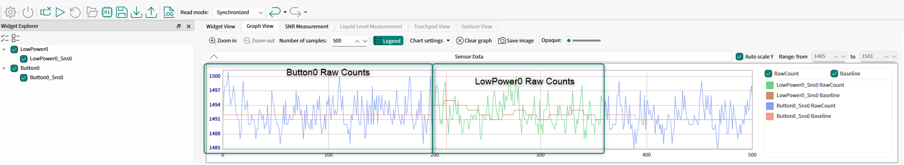

7. In the main.c file, add the following code to execute the sensor raw counts integrity checks
    * Update the raw count lower and upper limits based on the raw counts observed in the tuner. The recommended starting point for the lower and upper limit settings is &plusmn;20% of the observed raw counts.

```c
uint16_t lp_sensor_low_baseline = 1190;
uint16_t lp_sensor_high_baseline = 1790;
cy_en_capsense_bist_status_t lp_sensor_raw_count_bist;

lp_sensor_raw_count_bist = Cy_CapSense_CheckIntegritySensorRawcount(
    CY_CAPSENSE_LOWPOWER0_WDGT_ID,
    CY_CAPSENSE_LOWPOWER0_SNS0_ID,
    lp_sensor_high_baseline,
    lp_sensor_low_baseline,
    &cy_capsense_context
);
print_bist_test_result("LP Sensor Raw Count", lp_sensor_raw_count_bist);

uint16_t button0_low_baseline = 1190;
uint16_t button0_high_baseline = 1790;
cy_en_capsense_bist_status_t button0_raw_count_bist;

button0_raw_count_bist = Cy_CapSense_CheckIntegritySensorRawcount(
    CY_CAPSENSE_BUTTON0_WDGT_ID,
    CY_CAPSENSE_BUTTON0_SNS0_ID,
    button0_high_baseline,
    button0_low_baseline,
    &cy_capsense_context
);
print_bist_test_result("Button 0 Raw Count", button0_raw_count_bist);

/* Configure the MSCLP wake up timer as per the ACTIVE mode refresh rate */
Cy_CapSense_ConfigureMsclpTimer(ACTIVE_MODE_TIMER, &cy_capsense_context);
```

8. Ensure the **CAPSENSE&trade; Tuner** is disconnected, and then program the device
9. Observe the output of the test in the terminal

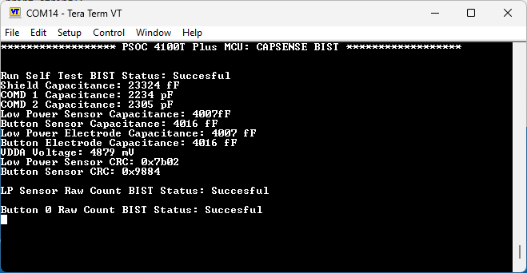

---

### Exploring BIST behavior

Now that the tests are being executed during the application initialization, check that they can identify errors:

* Short the sensor signal to ground
* Short the sensor signal to $V_{DDA}$
* Short the sensor signal to another GPIO, keeping in mind that the GPIO must be either configured for use by the CAPSENSE&trade; block, or set to strong output high or strong output low during the test execution
* Adjust the raw counts integrity upper and lower limits so that the test fails

### Conclusion

In this lab, you enabled and executed the built-in self-tests for the CAPSENSE&trade; middleware on the device. These tests can be used to verify that the MSCLP block and capacitive sensor GPIOs are functioning as expected before allowing the device to continue with normal operation.

---

## Executing the built-in self-tests periodically

### Objective
The BIST APIs can be executed periodically during runtime to verify that the device is still operating as expected.

### Adding method to execute self-tests periodically

1. Move the execution of the BIST and printing of their results into a dedicated function inside main.c

```c
void execute_capsense_bist(void)
{
    /* Execute all BIST functions and print results from section 3.
     * This is effectively all code as configured in earlier steps. */
}
```

2. Call this function in main.c during the initialization of the application

```c
/* Measures the actual ILO frequency and compensate MSCLP wake up timers */
Cy_CapSense_IloCompensate(&cy_capsense_context);

execute_capsense_bist();

/* Configure the MSCLP wake up timer as per the ACTIVE mode refresh rate */
Cy_CapSense_ConfigureMsclpTimer(ACTIVE_MODE_TIMER, &cy_capsense_context);
```

3. Open the **Device Configurator** from the ModusToolbox&trade; for VS Code extension by clicking the **Configure Device** button

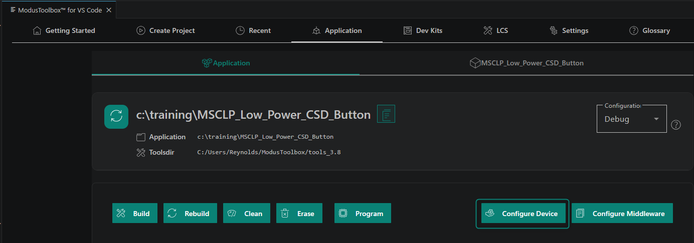


4. Enable **P5.6** as resistive pull-up with the input buffer on and set the interrupt trigger type to rising edge

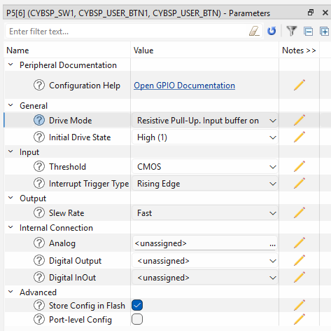

5. Save and close the **Device Configurator**
6. Add a button ISR and Boolean flag to main.c, as shown in the following code:

```c
static bool execute_bist = false;

void button_isr(void)
{
    execute_bist = true;
    Cy_GPIO_ClearInterrupt(CYBSP_USER_BTN1_PORT, CYBSP_USER_BTN1_PIN);
}
```

7. Enable the button IRQ inside main.c:

```c
cy_stc_sysint_t intrCfg =
{
    .intrSrc = CYBSP_USER_BTN1_IRQ,
    .intrPriority = 3UL
};

Cy_SysInt_Init(&intrCfg, button_isr);

/* Enable the interrupt */
NVIC_EnableIRQ(intrCfg.intrSrc);

/* Enable global interrupts */
__enable_irq();
```

8. When the button interrupt flag is set, execute the BISTs

```c
#if ENABLE_PWM_LED
led_control();
#endif

if (execute_bist)
{
    /* Simple debounce */
    Cy_SysLib_Delay(100);
    execute_bist = false;
    execute_capsense_bist();
}
```

9. Program the device
10. Observe the output after pressing **SW1**

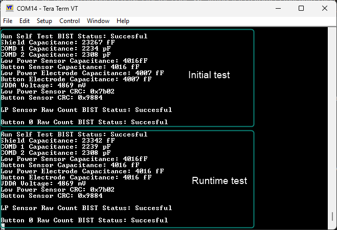

---

### Exploring BIST behavior

Now that the BISTs can be executed periodically during runtime, observe the test output while forcing errors during runtime:

* Touch the sensor, observe the green LED reporting the touch status, then while touching the button, press SW1 to trigger the BIST execution. This should not force an error, but the measured capacitance will change, so if this test is run with tighter boundaries, it will fail if it is run while a user is interacting with the system
* Configure SysTick to call the BISTs periodically

### Conclusion

In this lab, you executed the built-in self-tests during runtime. This shows that these tests can be used to periodically verify that the CAPSENSE&trade; hardware is functioning as expected. This is a critical process for ensuring proper safety while using CAPSENSE&trade; widgets to gate safety-critical operations.

---

## Revision history

| Document revision | Date | Description of changes |
| :--- | :--- | :--- |
| ** | 2026-08-24 | Initial release. |

### Disclaimer
All referenced product or service names and trademarks are the property of their respective owners.

The Bluetooth&reg; word mark and logos are registered trademarks owned by Bluetooth SIG, Inc., and any use of such marks by Infineon is under license.

PSOC&trade;, formerly known as PSoC&trade;, is a trademark of Infineon Technologies. Any references to PSoC&trade; in this document or others shall be deemed to refer to PSOC&trade;.

---------------------------------------------------------

© Cypress Semiconductor Corporation, 2023-2026. This document is the property of Cypress Semiconductor Corporation, an Infineon Technologies company, and its affiliates ("Cypress").  This document, including any software or firmware included or referenced in this document ("Software"), is owned by Cypress under the intellectual property laws and treaties of the United States and other countries worldwide.  Cypress reserves all rights under such laws and treaties and does not, except as specifically stated in this paragraph, grant any license under its patents, copyrights, trademarks, or other intellectual property rights.  If the Software is not accompanied by a license agreement and you do not otherwise have a written agreement with Cypress governing the use of the Software, then Cypress hereby grants you a personal, non-exclusive, nontransferable license (without the right to sublicense) (1) under its copyright rights in the Software (a) for Software provided in source code form, to modify and reproduce the Software solely for use with Cypress hardware products, only internally within your organization, and (b) to distribute the Software in binary code form externally to end users (either directly or indirectly through resellers and distributors), solely for use on Cypress hardware product units, and (2) under those claims of Cypress's patents that are infringed by the Software (as provided by Cypress, unmodified) to make, use, distribute, and import the Software solely for use with Cypress hardware products.  Any other use, reproduction, modification, translation, or compilation of the Software is prohibited.
<br>
TO THE EXTENT PERMITTED BY APPLICABLE LAW, CYPRESS MAKES NO WARRANTY OF ANY KIND, EXPRESS OR IMPLIED, WITH REGARD TO THIS DOCUMENT OR ANY SOFTWARE OR ACCOMPANYING HARDWARE, INCLUDING, BUT NOT LIMITED TO, THE IMPLIED WARRANTIES OF MERCHANTABILITY AND FITNESS FOR A PARTICULAR PURPOSE.  No computing device can be absolutely secure.  Therefore, despite security measures implemented in Cypress hardware or software products, Cypress shall have no liability arising out of any security breach, such as unauthorized access to or use of a Cypress product. CYPRESS DOES NOT REPRESENT, WARRANT, OR GUARANTEE THAT CYPRESS PRODUCTS, OR SYSTEMS CREATED USING CYPRESS PRODUCTS, WILL BE FREE FROM CORRUPTION, ATTACK, VIRUSES, INTERFERENCE, HACKING, DATA LOSS OR THEFT, OR OTHER SECURITY INTRUSION (collectively, "Security Breach").  Cypress disclaims any liability relating to any Security Breach, and you shall and hereby do release Cypress from any claim, damage, or other liability arising from any Security Breach.  In addition, the products described in these materials may contain design defects or errors known as errata which may cause the product to deviate from published specifications. To the extent permitted by applicable law, Cypress reserves the right to make changes to this document without further notice. Cypress does not assume any liability arising out of the application or use of any product or circuit described in this document. Any information provided in this document, including any sample design information or programming code, is provided only for reference purposes.  It is the responsibility of the user of this document to properly design, program, and test the functionality and safety of any application made of this information and any resulting product.  "High-Risk Device" means any device or system whose failure could cause personal injury, death, or property damage.  Examples of High-Risk Devices are weapons, nuclear installations, surgical implants, and other medical devices.  "Critical Component" means any component of a High-Risk Device whose failure to perform can be reasonably expected to cause, directly or indirectly, the failure of the High-Risk Device, or to affect its safety or effectiveness.  Cypress is not liable, in whole or in part, and you shall and hereby do release Cypress from any claim, damage, or other liability arising from any use of a Cypress product as a Critical Component in a High-Risk Device. You shall indemnify and hold Cypress, including its affiliates, and its directors, officers, employees, agents, distributors, and assigns harmless from and against all claims, costs, damages, and expenses, arising out of any claim, including claims for product liability, personal injury or death, or property damage arising from any use of a Cypress product as a Critical Component in a High-Risk Device. Cypress products are not intended or authorized for use as a Critical Component in any High-Risk Device except to the limited extent that (i) Cypress's published data sheet for the product explicitly states Cypress has qualified the product for use in a specific High-Risk Device, or (ii) Cypress has given you advance written authorization to use the product as a Critical Component in the specific High-Risk Device and you have signed a separate indemnification agreement.
<br>
Cypress, the Cypress logo, and combinations thereof, ModusToolbox, PSoC, CAPSENSE, EZ-USB, F-RAM, and TRAVEO are trademarks or registered trademarks of Cypress or a subsidiary of Cypress in the United States or in other countries. For a more complete list of Cypress trademarks, visit www.infineon.com. Other names and brands may be claimed as property of their respective owners.
